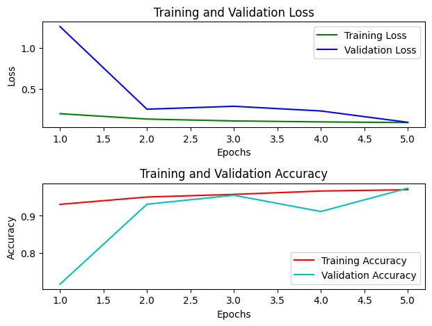
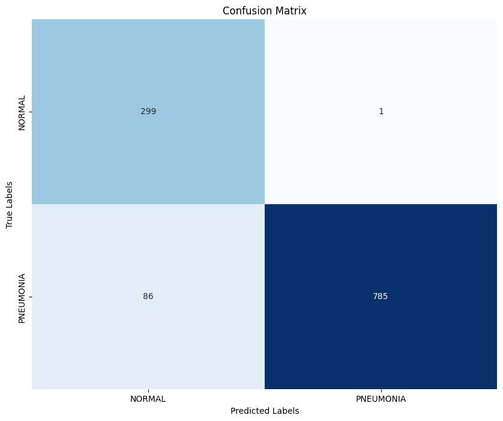
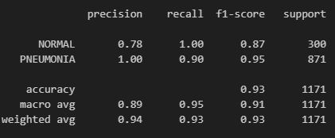
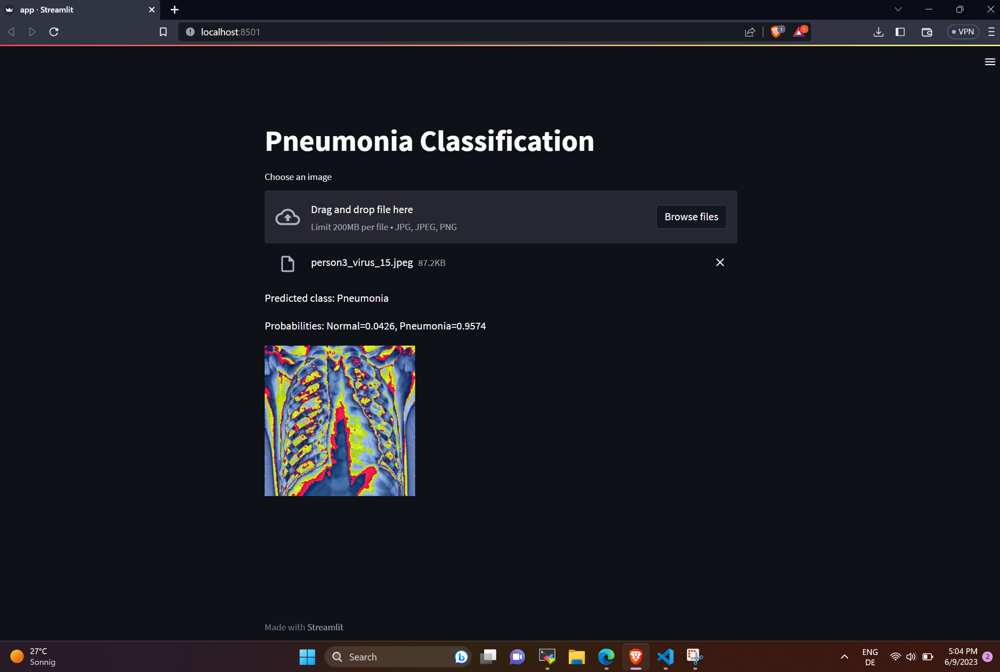

# Pneumonia classification

## Description of the Pneumonia Dataset
### The dataset is organized into 3 folders (train, test, val) and contains subfolders for each image category (Pneumonia/Normal). There are 5,863 X-Ray images (JPEG) and 2 categories (Pneumonia/Normal). 

 

### Becuse the dataset is imbalanced i combined all the images in one folder and split them into train, test and validation sets. After that i used data augmentation to increase the number of images in the training set.

 

### The model is trained using transfer learning with the EfficientNetB0 Pytorch-model. Then deploy the model using streamlit.

 

### __Results__:
 

 
 

 
 

 
 

